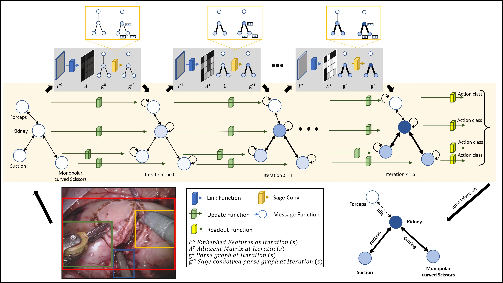
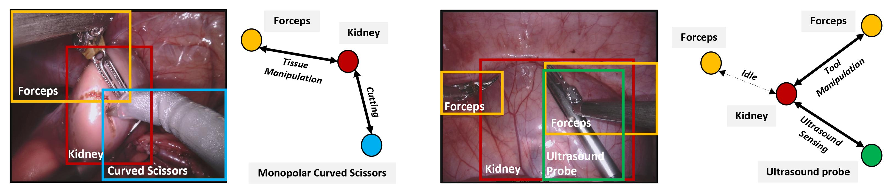

<div align="center">

<h2> Learning and Reasoning with the Graph Structure Representation in Robotic Surgery </h1>

<h4> Mobarakol Islam, lalithkumar Seenivasan, Lim Chwee Ming & Hongliang Ren </h3>

---
| **[ [```arXiv```](<https://arxiv.org/pdf/2007.03357.pdf>) ]** |**[ [```Paper```](<https://link.springer.com/chapter/10.1007/978-3-030-59716-0_60>) ]** |
|:-------------------:|:-------------------:|
    
International Conference on Medical Image Computing and Computer-Assisted Intervention (MICCAI) 2020
---

</div>     
    
---

The paper can be cited by using below bibtex.

```bibtex
@inproceedings{islam2020learning,
  title={Learning and reasoning with the graph structure representation in robotic surgery},
  author={Islam, Mobarakol and Seenivasan, Lalithkumar and Ming, Lim Chwee and Ren, Hongliang},
  booktitle={International Conference on Medical Image Computing and Computer-Assisted Intervention},
  pages={627--636},
  year={2020},
  organization={Springer}
}
```

# Abstract
Learning to infer graph representations and performing spatial reasoning in a complex surgical environment can play a vital role in surgical scene understanding in robotic surgery. For this purpose, we develop an approach to generate the scene graph and predict surgical interactions between instruments and surgical region of interest (ROI) during robot-assisted surgery. We design an attention link function and integrate with a graph parsing network to recognize the surgical interactions. To embed each node with corresponding neighbouring node features, we further incorporate SageConv into the network. The scene graph generation and active edge classification mostly depend on the embedding or feature extraction of node and edge features from complex image representation. Here, we empirically demonstrate the feature extraction methods by employing label smoothing weighted loss. Smoothing the hard label can avoid the over-confident prediction of the model and enhances the feature representation learned by the penultimate layer. To obtain the graph scene label, we annotate the bounding box and the instrument-ROI interactions on the robotic scene segmentation challenge 2018 dataset with an experienced clinical expert in robotic surgery and employ it to evaluate our propositions.


# Surgical Scene Graph
- The base interaction model "Graph Parsing Neural Networks" is adopted from [repository](https://github.com/SiyuanQi/gpnn) and integrated with attention to improve the performance. <br>
- To improve the model calibration, we integrated label smoothing by following this [repository](https://github.com/seominseok0429/label-smoothing-visualization-pytorch) 

## Proposed Architecture

<p align="center">

</p>

Proposed architecture: Given a surgical scene, firstly, label smoothened features *F* are extracted. The network then outputs a parse graph based on the *F*. The attention link function predicts the adjacent matrix of the parse graph. The thicker edge indicates possible interaction between the node. The SageConv embeds each node with its neighbouring node features. A brighter node color represents the existence of neighbouring node features within a node. The message function updates the node values based on the sum of interaction features between neighbour nodes. The hidden
features of each node are updated by the update node. The readout function predicts the node labels that signify the interaction type between the connected nodes.

# Dataset

<p align="center">

</p>

- Images: Left camera images from [2018 robotic scene segmentation challenge](https://arxiv.org/pdf/2001.11190.pdf) are used in this work.
- Bounding Box and interaction: [Our annotations](https://drive.google.com/file/d/16G_Pf4E9KjVq7j_7BfBKHg0NyQQ0oTxP/view?usp=sharing) (Cite this paper when using these annotations.)

## Feature Extraction:

- To be released!

Download samples of [`evalution data features`](https://drive.google.com/file/d/1OwWfgBZE0W5grXVaQN63VUUaTvufEmW0/view?usp=sharing).The features of the evaluation data is not from this paper. You can follow our extended work [ICRA+RA-L2022 paper](**[ [```arXiv```](<https://arxiv.org/abs/2201.11957>) ]** |**[ [```Paper```](<https://ieeexplore.ieee.org/document/9695281>) ]**|**[[```Github```](<https://github.com/lalithjets/Global-reasoned-multi-task-model.git>) ]**) to get information about feature extraction.


# Training
```bash
python main.py
```
# Evaluation
```bash
python evaluation_metrics.py
```

# Our Extended Works
1. Global-Reasoned Multi-Task Model for Surgical Scene Understanding (**[ [```arXiv```](<https://arxiv.org/abs/2201.11957>) ]** |**[ [```Paper```](<https://ieeexplore.ieee.org/document/9695281>) ]**|**[[```Github```](<https://github.com/lalithjets/Global-reasoned-multi-task-model.git>) ]**)